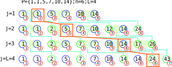

# Boundary package-merge algorithm Common Lisp implementation
The boundary package-merge algorithm is an algorithm for building length-limited
Huffman codes [1]. For an alphabet of _n_ symbols and with a constraint of
maximum length _L_ for the encoded messages, this algorithm has _O(n.L)_ time
complexity and _O(L^2)_ space complexity.

This is better than the package-merge algorithm on which it is based [2]. The
package-merge algorithm is _O(n.L)_ time and _O(n)_ space.

Note that this algorithm has since been surpassed by others. Please only treat
this implementation as an alternative means to test your own implementations of
actually up to date algorithms.
## Recommended reading
The full proof of why the boundary package-merge works can be understood by
reading just [2] and [1], preferably in this order. This is for readers
already familiar with the Huffman encoding problem, on which you will otherwise
find many resources online (sadly accompanied by the naive inefficient
implementation from the original paper!).

Historically, algorithms for length-limited Huffman encoding existed but with
much worse complexities, some being iterative in nature. You can find
some of them as references in [1,2].

Basically, the problem of Huffman encoding with messages of limited-length
can be reduced to the binary coin collector's problem. The coin collector
problem was also coined in [2] in order to present the package-merge algorithm.

The package-merge algorithm was then improved in [1] by very clever analysis and
new ways of looking at the problem.

## Algorithm presentation
The understanding of the full mathematical proof is not required to understand
the boundary package-merge algorithm.

The example from [1], with more colors and details, is:

## Changes to the algorithm
The boundary package-merge algorithm, can be improved in minor ways to increase
performance. I took the benchmark case of encoding 100k symbols of random
weights to quantify the improvements.
Some of these changes are straightforward, it is possible that they were even
implied in [1], however they are not explicit in the raw implementation 
presented in the paper.

* Computation of chain pairs in the sets preceding _j_ only if needed. The
algorithm in [1] implemented literally involves asking for nodes that will
possibly never be considered for insertion as packages. The performance impact
is almost a division by 2 in execution time for our test case. It seems that
implementing this change necessarily comes at the cost of adding an auxiliary
array of booleans of length _L - 1_ to keep track of whether new pairs are
needed. This cost is negligeable.
* Keeping *weights* around is actually unnecessary. We only need one number per
set _j_. We need only the last weight of each set, replaced by the sum *s* of
the weights of the two last elements that are about to become a package.
* Only one in two chains is needed actually: the second of each package. This
requires tracking the last count and last tail of each set *j*.

## References
1. Katajainen J., Moffat A., Turpin A. (1995) A fast and space-economical algorithm for length-limited coding. In: Staples J., Eades P., Katoh N., Moffat A. (eds) Algorithms and Computations. ISAAC 1995. Lecture Notes in Computer Science, vol 1004. Springer, Berlin, Heidelberg. https://doi.org/10.1007/BFb0015404
1. Larmore, Lawrence L., and Daniel S. Hirschberg. "A fast algorithm for optimal length-limited Huffman codes." Journal of the ACM (JACM) 37.3 (1990): 464-473. https://doi.org/10.1145/79147.79150
